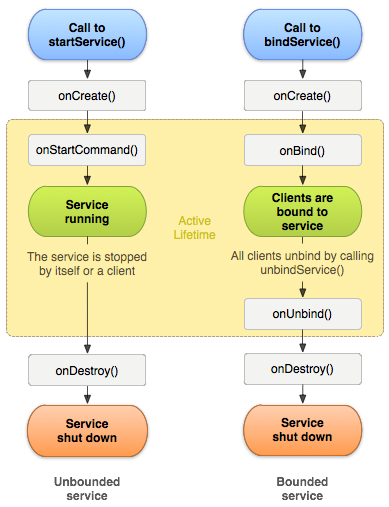
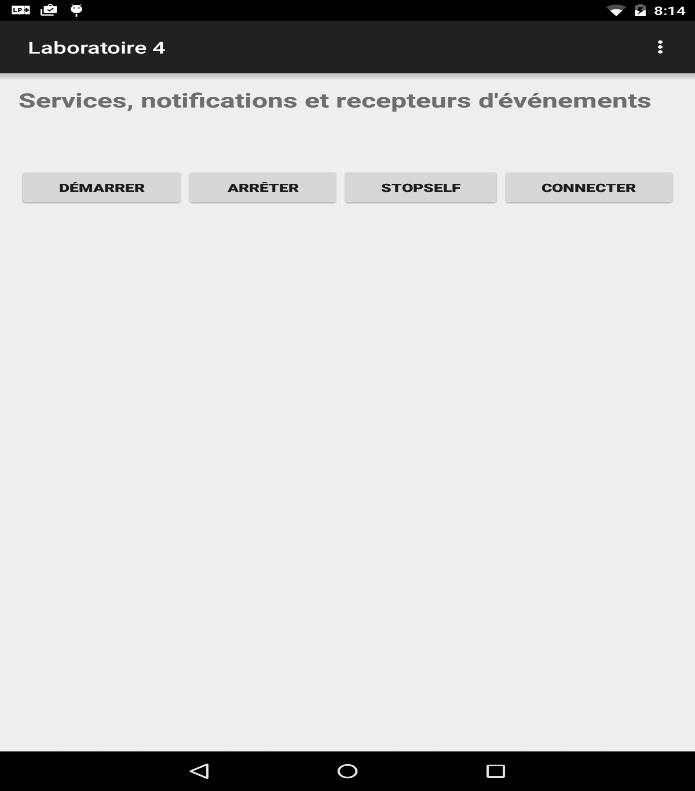
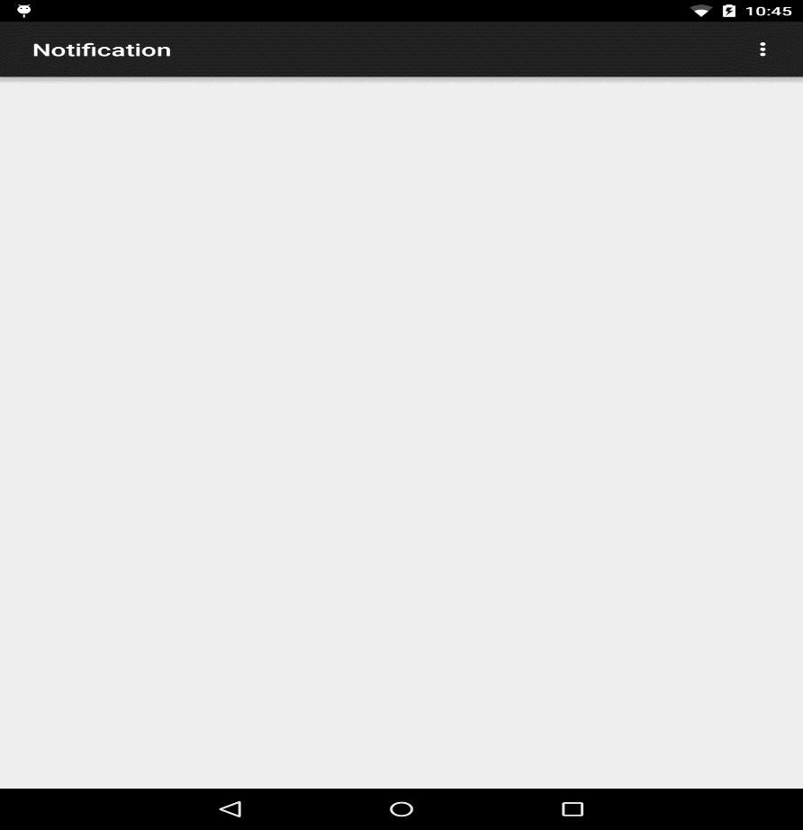

<div style="text-align: center; font-weight: bold;">
Laboratoire 5<br/>
Services, notifications et récetpeurs d'événements
</div>

# Objectifs d'apprentissage

* Comprendre le cycle de vie d’un service
* Créer un service
* Lancer, arrêter un service directement
* Se connecter à un service
* Se déconnecter d’un service
* Créer et envoyer une notification
* Créer et utiliser un récepteur d’évènements  

## Cycle de vie d’un service

Un service est un composant applicatif qui ne possède pas d’interface graphique et qui s’exécute en arrière-plan. Son utilisation peut être limitée à l’application où il est défini ou proposée à d’autres applications. Ce type d’information est précisé dans le fichier manisfest lors de la déclaration du service. Un service peut être lancé de deux façons : 

- Directement : en appelant la méthode `startService()` qui prend en argument un objet intent implicite ou explicite, permettant d’identifier le service à démarrer. Le service peut être arrêté à tout moment en appelant la méthode `stopService()`. Il peut aussi mettre fin à sa propre exécution à l’aide la méthode `stopSelf()`. 

- En établissant une connexion (**bindService()**) : Ceci permet une communication client-serveur entre les composants. Dans ce cas, le service est détruit quand tous les clients sont déconnectés.

Les deux méthodes peuvent être utilisées en même temps.



**Important** : Un service s’exécute dans le thread principal de l’application. Il est fortement conseillé de créer des threads pour vos services afin de dédier le thread principal aux interactions avec l’utilisateur.

### **Lancement et arrêt d'un service**

- Créer un nouveau projet Laboratoire 5. La vue activity_main doit ressembler à ce qui suit :



- Programmer le clic des boutons en affichant simplement `Log.i("MainActivity", "`*`nom du bouton cliqué`*`")` où `MainActivity` constitue le filtre pour l’affichage.

- Exécuter votre application. Vérifier que tous vos boutons répondent au clic

-  Ajouter une classe TestService, sous classe de Service à votre projet. Programmer les fonctions de rappel suivantes :

``` java
public class TestService extends Service {
    @Override
    public void onCreate() {
        super.onCreate();
        Log.i("TestService", "onCreate");
    }

    public int onStartCommand(Intent intent, int flags, int startId) {
        // L'exécution de cette méthode se fait dans le thread principal.
        // Pour ne pas bloquer l'application, il est vivement recommandé
        // d'exécuter tout traitement long dans un thread secondaire
        Log.i("TestService", "onStartCommand: startId=" + startId);
        return super.onStartCommand(intent, flags, startId);
    }

    @Override
    public IBinder onBind(Intent intent) {
        return null;
    }
}
```

- Ajouter le code suivant au clic du bouton Démarrer pour lancer le service.

``` java
final Intent intent = new Intent(this,TestService.class);
startService(intent);
```

- Déclarer le service dans le fichier `AndroidManifest.xml`

``` xml
<service android:name=".TestService"></service>
```

- Exécuter. Observer l’exécution des méthode `onCreate()` et `onStartCommand()` du service. Noter la valeur du paramètre startId.

- Peser plusieurs fois sur le bouton Démarrer. Observer les nouvelles valeurs du paramètre startId.

- Quitter l’application. Y revenir, puis cliquer à nouveau sur Démarrer. Remarquer que le service n’a pas été arrêté. Il ne repasse pas par onCreate(). Il continue à incrémenter la valeur du paramètre startId de la méthode `onStartCommand()`

- Compléter la classe `TestService` avec les méthodes suivantes :

``` java
public void onDestroy() {
    Log.i("TestService", "onDestroy");
    super.onDestroy();
}
```

- Dans la classe `MainActivity`, compléter le clic du bouton Arrêter comme suit :

``` java
final Intent intent = new Intent(this,TestService.class);
stopService(intent);
```

- Exécuter à nouveau. Peser sur Démarrer (une ou plusieurs fois). Cliquer sur le bouton Arrêter. Obverser l’exécution de la fonction de rappel `onDestroy()` du service. Redémarrer le service. Observer le comportement. 

- Pour programmer le bouton stopSelf qui permet au service de mettre fin à sa propre exécution. Ajouter le code suivant à la classe `TestService`

``` java
public class TestService extends Service {
    public static final String CLE_STOP = "stop";
    public int onStartCommand(Intent intent, int flags, int startId) {
        final boolean stop = intent.getBooleanExtra(CLE_STOP, false);

        if (stop) {
            Log.i("TestService", "stopSelf");
            stopSelf();
        }
    }
}
```

- Ajouter le code suivant au clic du bouton stopSelf da la classe `MainActivity`

``` java
final Intent intent = new Intent(this, Testservice.class);
intent.putExtra(TestService.CLE_STOP, true);
startService(intent);
```

- Éxecuter. Observer le comportement.

### Connexion et déconnexion d'un service

- Compléter la classe `TestService` comme suit:

``` java
// Cette classe est une spécialisation de la classe Binder.
// elle retourne une instance du service TestService
public class MonServiceBinder extends Binder {
    public TestService getService() {
        return TestService.this;
    }
}

// créer une référence vers l'instance du service TestService
private final IBinder mBinder = new MonServiceBinder();

// remplacer la méthode `**`onBind()`**` par :
public IBinder onBind(Intent intent) {
    Log.i("TestService", "onBind");
    return mBinder;
}

@Override
public boolean onUnbind(Intent intent) {
    Log.i("TestService", "onUnbind");
    return true;
}
```

- Compléter la classe `MainActivity` comme suit :

``` java
private TestService mService;

// définition de la connexion
private final ServiceConnection mConnexion = new ServiceConnection() {
    public void onServiceConnected(ComponentName arg0, IBinder arg1) {
        Log.i("MainActivity", "onServiceConnected");
        mService = ((TestService.MonServiceBinder) arg1).getService();
        btnConnectDeconnect.setText(R.string.service_bouton_Deconnect);
    }

    public void onServiceDisconnected(ComponentName arg0) {
        Log.i("MainActivity", "onServiceDisconnected");
        mService = null;
        btnConnectDeconnect.setText(R.string.service_bouton_Connect);
    }
};

// dans le clic du bouton Connecter/deconnecter
if (mService == null) {
    final Intent intent = new Intent(this, Testservice.class);
    bindService(intent, mConnexion, Context.BIND_AUTO_CREATE);
} else {
    unbindService(mConnexion);
    mService = null;
    btnConnectDeconnect.setText(R.String.service_bouton_Connect);
}
```

**IMPORTANT:** ne pas oublier de déclarer les chaines de caractères dans le fichier ressource strings.

- Exécuter à nouveau. Cliquer sur Connecter. Observer la passage du service par les méthodes `onCreate()`, `onBind()` et `onServiceConnected()`

- Cliquer sur Démarrer. Noter qu’il ne repasse plus pas `onCreate()`. Il exécute directement `onStartCommand()`.

- Essayer d’arrêter le service une fois connecté…

- Peser sur Deconnecter. Observer le comportement.

- Essayer plusieurs séquences de clics pour bien comprendre le cycle de vie d’un service.

## Notifications

La barre de notification ou barre de statut permet aux applications tournant en tâche de fond d’avertir l’utilisateur sans perturber l’utilisation courante de l’appareil. Cette barre reçoit et stocke les notifications qui lui sont envoyées par les applications.

### Création et envoi d'une notification

- Compléter la vue `MainActivity` pour avoir ce qui suit:


- Ajouter l’activité NotificationActivity à votre projet (new/Activity..). Cette activité sera appelée quand on clique sur la notification. Pour la distinguer, il suffit de lui donner le titre Notification (propriété label). Sa vue ne contient aucun composant (supprimer celui qui vient par défaut).



- Ajouter le code suivant au clic du bouton ajouter une notification. Bien vous documenter sur chacune des opérations pour bien comprendre le processus de création et d’envoi d’une notification. Ajouter toutes les chaînes nécessaires dans le fichier ressource strings.xml. **Le titre de la notification étant : test notification** et le texte : **Un clic ouvre l’activité Notification**. Nous utiliserons le logo de GG comme icône à gauche de la notification

``` java
Bitmap mLogo = BitmapFactory.decodeResource(getResources(), R.drawable.logogg);
final long[] patternVibrations = { 0, 50, 50, 50, 50, 50, 50, 50, 50, 50, 50, 50, 50,50 };

// création de la notification. Noter cette nouvelle façon de créer un objet final
Notification.Builder notificationBuilder = new Notification.Builder(this)
    .setLargeIcon(mLogo)
    .setAutoCancel(true) // Notification disparaît quand l'utilisateur la touche.
    .setSmallIcon(R.drawable.ic_launcher)
    .setContentTitle(getString(R.string.notification_titre))
    .setContentText(getString(R.string.notification_text))
    .setNumber(1)
    .setVibrate(patternVibrations);

// définition de l’activité qui sera lancée par la notification
final Intent notificationIntent = new Intent(this, NotificationActivity.class);
notificationIntent.addFlags(Intent.FLAG_ACTIVITY_NEW_TASK);

final PendingIntent pendingIntent = PendingIntent.getActivity(this, 0, notificationIntent, 0);
notificationBuilder.setContentIntent(pendingIntent);

// noter l’utilisation d’un PendingIntent. (Intention en attente)
// envoi de la notification
final Notification notification = notificationBuilder.getNotification();
Toast.makeText(this, (notification == null) ? R.string.notification_erreur : R.string.notification_ajoutee, Toast.LENGTH_LONG).show();
if (notification != null) {
    final NotificationManager notificationManager = (NotificationManager) getSystemService(Context.NOTIFICATION_SERVICE);
    notificationManager.notify(0, notification);
}
```

- Exécuter. Une erreur apparaît sur les versions 4.0.X et moins.

- Pour corriger la situation, il faut ajouter dans le fichier AndroidManifest la permission pour les vibrations :

``` xml
<uses-permission android:name="android.permission.VIBRATE" />
```

Cette balise est dans la balise manifest mais en dehors de la balise application

- Exécuter. Cliquer sur la notification. Vérifier que l’activité `NotificationActivity` s’affiche. Noter que la notification disparaît de la barre de statut juste après le clic.

### Utilisation d'une notification dans le cas d'un service

Nous allons compléter la classe TestService pour permettre l’affichage d’une notification informant que le service est bien démarré. Contrairement à la notification créée en 2.1, celle-ci sera persistante. Elle ne pourra donc pas être supprimée par l’utilisateur. Il faudra s’assurer que l’application la supprime quand le service sera détruit.

- Ajouter la méthode suivante à la classe `TestService`

``` java
private void afficherNotification(final int nb) {
    Bitmap mLogo = BitmapFactory.decodeResource(getResources(), R.drawable.logogg);
    final long[] patternVibrations = { 0, 50, 50, 50, 50, 50, 50, 50, 50, 50, 50, 50, 50,50 };

    final Notification.Builder notificationBuilder = new Notification.Builder(this)
        .setLargeIcon(mLogo)
        .setOngoing(true) //persistante. ne peut être supprimée par l'utilisateur
        .setSmallIcon(R.drawable.ic_launcher)
        .setContentTitle(getString(R.string.notification_service_titre))
        .setContentText(getString(R.string.notification_service_text))
        .setNumber(1)
        .setVibrate(patternVibrations);

    final Notification notification = notificationBuilder.getNotification();

    if (notification != null) {
        final NotificationManager notificationManager = (NotificationManager) getSystemService(Context.NOTIFICATION_SERVICE);
        notificationManager.notify(0, notification);
    }
}
```

- Dans le fichier strings.xml, ajouter les chaînes notification_service_titre et notification_service_text avec comme valeurs respectives Le service TestService est démarré et cette notification ne peut être supprimée par l’utilisateur

- Ajouter l’instruction suivante dans la méthode `onStartCommand(Intent intent, int flags, int startId)`  

``` java
afficherNotification(startId);
```

- Pour supprimer la notification de la barre de statut quand le service est arrêté, ajouter le code suivant dans la méthode `public void onDestroy()`

``` java
final NotificationManager notificationManager = (NotificationManager) getSystemService(Context.NOTIFICATION_SERVICE);
notificationManager.cancel(0);
```

- Afin de permettre aussi la notification lorsque le service est démarré via une connexion (binding), ajouter l’instruction suivante dans la méthode `onBind(Intent intent)`

``` java
afficherNotification(0);
```

- Tester votre application en démarrant le service, puis l’arrêter pour faire disparaître la notification de la barre de statut. Refaire l’opération à l’aider d’une connexion au service.

- Démarrer à nouveau le service. Quitter l’application. Relancer votre application. Noter la présence de la notification (le service continue à fonctionner en tâche de fond).

## Récepteurs d'évènements

Un récepteur d’évènements est un composant applicatif dont le rôle consiste uniquement à réagir à des évènements auxquels il est abonné (modèle de conception Observer). Exple: arrivée d’un SMS, batterie faible. Comme le service, il ne possède pas d’interface graphique. Lorsqu’il reçoit un évènement, s’il désire informer l’utilisateur, il doit le faire en utilisant la barre de notification ou en lançant une activité. L’exécution d’un récepteur d’évènements s’opère dans le thread principal du processus de l’application où il est défini. Il ne devrait pas bloquer le thread principal plus de dix secondes. Les évènements sont produits soit par le système, soit par des applications. Ils sont envoyés aux récepteurs d’évènements susceptibles de recevoir l’évènement donné. Les évènements sont des objets de type Intent décrivant une action qui vient d’être réalisée ou un évènement qui vient de se produire. L’envoi de l’intent se fait de manière asynchrone pour ne pas bloquer le composant émetteur de l’évènement.

- Ajouter la classe suivante à votre application

``` java
public class RecepteurEvenements extends BroadcastReceiver {
    @Override
    public void onReceive(Context context, Intent intent) {
        Toast.makeText(context, R.string.reception_evenement, Toast.LENGTH_SHORT).show();
    }
}
```

- Définir la chaîne reception_evenement avec la valeur : onReceive : évènement reçu

- Programmer le clic du bouton envoyer un évèment comme suit :

``` java
final Intent intent = new Intent("votreEspaceDeNom.laboratoire4.EVENEMENT_1");
sendBroadcast(intent);
```

- Déclarer le récepteur d’évènements dans le fichier `AndroidManifest` (dans la balise Application)

``` xml
<receiver android:name=".RecepteurEvenements">
    <intent-filter>
        <action android:name=" votreEspaceDeNom.laboratoire4.EVENEMENT_1" />
    </intent-filter>
</receiver>
```

- Tester votre application.

## Remarque

Avant de recevoir son premier évènement, le composant est inactif. Il devient actif dès qu’il reçoit un évènement en paramètre de sa méthode `onReceive()` Dès la sortie de cette méthode, le composant redevient inactif. Attention au cas où le récepteur d’évènement lance un thread. Le système pourrait tuer le processus de l’application, donc du thread. Pour éviter ce problème, il est conseillé de lancer le thread depuis un service. Le système détectera le service comme actif et ne tuera donc pas le processus, sauf dans des cas extrêmes de besoin de ressources.
