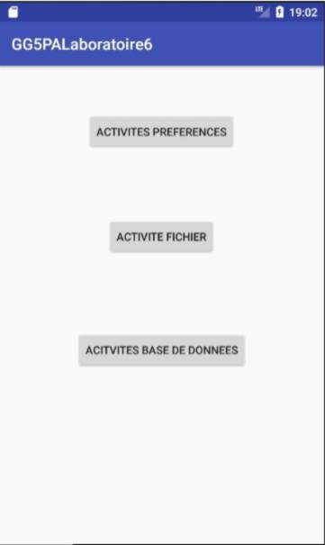
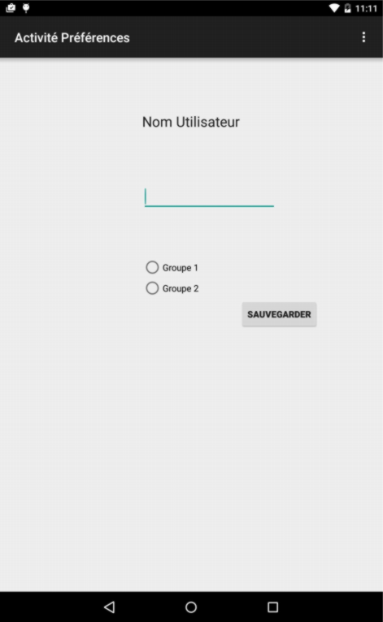
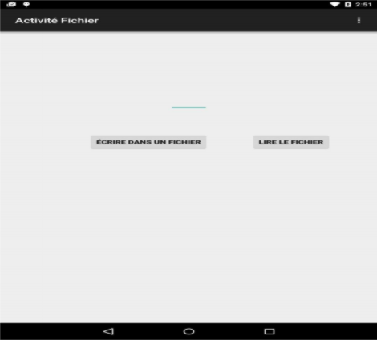
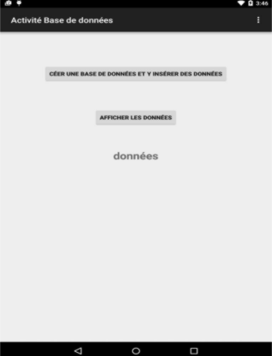

# Lab6 corrigé

## Objectifs d'apprentissage

* Créer et utiliser les fichiers de préférences
* Manipulation des fichiers standards d’Android
* Créer et manipuler une base de données SQLite
* Comprendre les fournisseurs de contenus
* Défi 3

Les fichiers de préférences, les fichiers standards et les bases données sont des mécanismes offerts par Android pour assurer la persistance des données.

## 1. Les fichiers de préférences

Cette technologie est semblable à la base de registre de Windows ou `java.util.pref` de Java. Des données de configuration de type primitif sauvegardées sous forme de clés/valeurs, sont récupérées lors du chargement de l’application et sont mises à jour dans le programme à l’aide d’une interface graphique appropriée.

- Créer un nouveau projet Laboratoire 6. La vue `activity_main` doit ressembler à ce qui suit :

- Créer `PreferencesActivity` dont l’interface graphique contient une zône de saisie, deux boutons radio ( utiliser le composant `RadioGroup`) et un bouton sauvegarder. Dans le fichier `strings.xml`, changer la valeur de `title_activity_preferences` (propriété label de l’activité) pour avoir ce qui suit :

- Programmer le clic du bouton Activité préférences de `MainActivity` qui appelle l’activité `PreferencesActivity`.

- Compléter la classe `PreferencesActivity` avec le code suivant :

~~~ java
public class PreferencesActivite extends AppCompatActivity {
    private static final String PREF_UTIL = "util";
    private static final String PREF_CHOIX = "choix";
    private static final int GROUPE_1 = 0;
    private static final int GROUPE_2 = 1;
    private RadioGroup mChoixRB;
    private EditText mEdText;

    @Override
    public void onCreate(Bundle savedInstanceState) {
        super.onCreate(savedInstanceState);
        setContentView(R.layout.activity_preferences);
        mChoixRB = (RadioGroup) findViewById(R.id.radioGroup);
        mEdText = (EditText) findViewById(R.id.editText);
        restaurer();
    }

    // Code pour le clic du bouton sauvegarder (ne pas oublier d'ajouter cette fonction dans la propriété "onClick" du bouton)
    public void onClickBtnSauvegarder(View v) {
        //création du fichier de préférences
        final SharedPreferences.Editor editPrefs = getPreferences(Context.MODE_PRIVATE).edit();

        final int choix = (mChoixRB.getCheckedRadioButtonId() == R.id.radio0)? GROUPE_1 : GROUPE_2;
        //écriture dans le fichier de préférences
        editPrefs.putInt(PREF_CHOIX, choix)
            .putString(PREF_UTIL, mEdText.getText().toString())
            .apply();
    }

    private void restaurer() {
        // lecture du fichier de préférences.
        final SharedPreferences prefs = getPreferences(Context.MODE_PRIVATE);
        final int choix = prefs.getInt(PREF_CHOIX, 0);
        mChoixRB.check((choix == GROUPE_1) ? R.id.radio0 : R.id.radio1);
        final String texte = prefs.getString(PREF_UTIL, "");
        mEdText.setText(texte);
    }
}
~~~

Le nom du fichier (XML) de préférences est par défaut celui de l’activité concernée. Si on veut en créer plusieurs, il faut préciser le nom à la méthode `getPreferences` juste avant le mode de création (`Context.MODE_PRIVATE`).

- Pour tester la sauvegarde des données dans le fichier de préférences. Exécuter votre application. Entrer un nom d’utilisateur, faîte un choix de groupe. Sauvegarder.

- Quitter l’application puis la relancer. Observer l’état des composants de l’activité `PreferencesActivity`.

- Refaire la même manipulation mais sans sauvegarder cette fois-ci. Observer le résultat

## 2. Les fichiers standards

Les fichiers de préférences constituent la solution pour des données de type primitif. Mais si on veut stocker des données plus complexes ou des données brutes, il faut pouvoir créer, lire et écrire dans des fichiers. Android permet d’enregistrer des fichiers sur le stockage interne de l’appareil ou sur un stockage externe (une carte SD par exemple). L’exemple suivant consiste à créer, lire et écrire un fichier sur le stockage interne.

- Ajouter une classe `FichierActivity` à votre projet dont l’interface graphique contient : une zone de saisie, un bouton Ecrire dans un Fichier et un bouton Lire le Fichier :

- Programmer le clic du bouton Activite Fichier de la classe `MainActivity` pour appeler `FichierActivity`.

- Compléter la classe `FichierActivity` comme suit :

~~~ java
class FichierActivity extends AppCompatActivity {
    private static final String NOM_FICHIER = "donnees.dat";
    private EditText mEdText;

    @Override
    public void onCreate(Bundle savedInstanceState) {
        super.onCreate(savedInstanceState);
        setContentView(R.layout.activity_fichier);

        mEdText= (EditText) findViewById(R.id.edTextFich);
        //edTextFich est le nom de votre zone de saisie
    }

    /*
    * Clic du bouton Ecrire dans un Fichier
    */
    public void onClickBtnEcrireFichier(View v) {
        FileOutputStream fos = null;
        OutputStreamWriter osw= null;
        try {
            fos = openFileOutput(NOM_FICHIER,MODE_APPEND);

            osw = new OutputStreamWriter(fos);
            osw.write(mEdText.getText().toString());
            osw.flush();

            Toast.makeText(this, "données écrites", Toast.LENGTH_SHORT).show();
        } catch (Exception e) {
            Toast.makeText(this, "données non écrites", Toast.LENGTH_SHORT).show();
        }
        finally {
            try {
                osw.close();
                fos.close();
            } catch (IOException e) {
                Toast.makeText(this, "données non écrites ", Toast.LENGTH_SHORT).show();
            }

        }
    }

    /*
    * Clic du bouton Lire le fichier
    */
    public void onClickBtnLireFichier(View v) {
        FileInputStream fis = null;
        InputStreamReader isr = null;
        char[] inputBuffer = new char[255];
        String donnee = null;
        try {
            fis = openFileInput(NOM_FICHIER);
            isr = new InputStreamReader(fis);
            isr.read(inputBuffer);
            donnee = new String(inputBuffer);
            //affiche le contenu de mon fichier dans un popup surgissant
            Toast.makeText(this, donnee.toString(), Toast.LENGTH_SHORT).show();
        } catch (Exception e) {
            Toast.makeText(this, "fichier non lu", Toast.LENGTH_SHORT).show();
        }
    }
}
~~~

## 3. Les bases de données

Android fournit `SQLiteOpenHelper`, une classe abstraite, pour la création et la mise à jour des bases de données.

- Programmer le bouton Activite Base de données pour afficher l’activité suivante (`BDActivity`)

Voici le code de la classe `BDActivity`

~~~ java
public class BDActivity extends AppCompatActivity {
    private class BDAssistant extends SQLiteOpenHelper {
        private static final int VERSION = 1;
        private static final String NOM_BASE = "maBase";
        private static final String NOM_TABLE = "maTable";
        private static final String CHAMP_NOM = "nom";
        private static final String CHAMP_PRENOM = "prenom";

        public BDAssistant(Context context) {
            super(context, NOM_BASE, null, VERSION);
        }

        @Override
        public void onCreate(SQLiteDatabase arg0) { // création de la base de données
            arg0.execSQL(String.format("CREATE TABLE %s (%s INTEGER PRIMARY KEY AUTOINCREMENT, %s TEXT, %s TEXT)",
                NOM_TABLE, BaseColumns._ID, CHAMP_NOM, CHAMP_PRENOM));
        }

        @Override
        public void onUpgrade(SQLiteDatabase arg0, int arg1, int arg2) { }
    } // fin de la classe BDAssistant

    @Override
    protected void onCreate(Bundle savedInstanceState) {
        super.onCreate(savedInstanceState);
        setContentView(R.layout.activity_bd);
    }

    private void insererDonnees() {
        final BDAssistant bdAss = new BDAssistant(this);
        final SQLiteDatabase bd = bdAss.getWritableDatabase();

        ContentValues valeurs = new ContentValues();

        valeurs.put(BDAssistant.CHAMP_NOM, "Nom1_"+ System.currentTimeMillis());
        valeurs.put(BDAssistant.CHAMP_PRENOM, "Prénom1_" + System.currentTimeMillis());
        bd.insertOrThrow(BDAssistant.NOM_TABLE, null, valeurs);

        valeurs = new ContentValues();

        valeurs.put(BDAssistant.CHAMP_NOM, "Nom2_"+ System.currentTimeMillis());
        valeurs.put(BDAssistant.CHAMP_PRENOM, "Prénom2_" + System.currentTimeMillis());
        bd.insertOrThrow(BDAssistant.NOM_TABLE, null, valeurs);

        bd.close();
        bdAss.close();
    }

    private void lireBD() {
        final BDAssistant bdAss = new BDAssistant(this);
        final SQLiteDatabase bd = bdAss.getReadableDatabase();
        final StringBuffer noms = new StringBuffer("Noms et Prénoms :\n\n");

        final Cursor curseur = bd.query(
            BDAssistant.NOM_TABLE,
            new String[] { BDAssistant.CHAMP_NOM, BDAssistant.CHAMP_PRENOM },
            null, null, null, null,
            BDAssistant.CHAMP_NOM + " desc");

        while (curseur.moveToNext()) {
            final String nomEtPrenom = curseur.getString(0) + " " + curseur.getString(1);
            noms.append(nomEtPrenom + "\n\n");
        }

        bd.close();
        bdAss.close();

        final TextView tvNoms = (TextView) findViewById(R.id.tvNoms);
        tvNoms.setText(noms);
    }

    public void onClickBtnCreer(View v) {
        insererDonnees();
        Toast.makeText(this,"données insérées avec succès",Toast.LENGTH_SHORT).show();
    }

    public void onClickBtnAfficherDonnees(View v) {
        lireBD();
        Toast.makeText(this,"données lues avec succès",Toast.LENGTH_SHORT).show();
    }
}
~~~

**Remarque** : tvNoms est l’identificateur du `textView` où seront affichées les données lues.

## 4. Les fournisseurs de contenus

[Android Content Providers](https://developer.android.com/guide/topics/providers/content-providers)

Les fournisseurs de contenus permettent de partager des données entre toutes les applications. Il existe par défaut plusieurs fournisseurs de contenus pour les données audio, vidéo, images et contacts personnels. Il est aussi possible d’en créer. Quel que soit la solution de stockage utilisée par les fournisseurs de contenus, ces derniers exposent la même interface. Les données sont retournées sous forme de tables de base de données. Chaque ligne est un enregistrement et chaque colonne est une valeur correspond au champ concerné. 
Chaque enregistrement (ligne) est identifié de façon unique à l’aide d’un champ numérique \_ID.
Chaque table a une URI unique. Il y aura donc autant d’URI que de tables de données.
Synatxe générale d’une URI : 

`Content://`_`autorité de L'URI`_`/`_`sous-chemin`_`/`_`id`_` `

- **Autorité de l'URI**: identifie le content provider correspondant à l'URI

- **Sous-chemin** : permet au fournisseur de déterminer le type de données. Vide, s’il un seul type de données est géré.

- **id** : identifiant unique de l’enregistrement demandé (champ \_ID). Vide si la requête concerne plus d’un enregistrement.

URI pour obtenir les données des contacts : `ContactsContract.Contacts.CONTENT_URI`

Pour pouvoir utiliser les contacts, il faut ajouter les permissions suivantes dans le fichier `manifest.xml`:

- ` `**`android.permission.READ_CONTACTS`**` ` : pour accéder aux données des contacts
- ` `**`android.permission.WRITE_CONTACTS`**` ` : pour ajouter, modifier ou supprimer des contacts.

Utiliser l’aide en ligne pour bien comprendre la mise en œuvre des opérations d’ajout, de suppression, d’interrogation et de mise à jour des données du fournisseur de contenus `ContactsContract.Contacts`
Parler de `ContactProviderOperation` , `ContactsContract` et de `Contacts.Contract.Data`

## 5. Défi 3 à remettre sur le **_R_**

[Exemple d'ajout de contact](https://www.dev2qa.com/android-add-contact-programmatically-example/)  
[DataContacts.Data (Ajouter, modifer, supprimer et query un contact)](https://developer.android.com/reference/android/provider/ContactsContract.Data)

Concevoir et réaliser une application Android qui offre les opérations suivantes :

- **Ajout d’un contact**
    - En utilisant une intention implicite
    - En ajoutant directement le contact dans la base de données des contacts (nom, prénom, courriel et type de courriel (ex « travail »). Vous aurez certainement besoin de savoir comment les persmissions fonctionnent dans les versions récentes d'android: [exemple ici](http://inthecheesefactory.com/blog/things-you-need-to-know-about-android-m-permission-developer-edition/en)

 Dans cette partie, vous pouvez utiliser une AlertDialog pour vous offrir les choix :

~~~ java
final AlertDialog.Builder builder = new AlertDialog.Builder(this);

builder.setItems(
    new String[]{" Utiliser une intention implicite", "Ajouter directement dans la BD"},
    new DialogInterface.OnClickListener() {
        public void onClick(DialogInterface dialog, int item) {
        Toast.makeText(
            getApplicationContext(),
            "item choisi : " + item,
            Toast.LENGTH_LONG)
            .show();

        // faire le traitement correspondant
        } 
    });

builder.create().show();
~~~

- **Recherche d’un contact** dont on connaît le nom et le prénom
- **Suppression d’un contact** en fournissant le nom et le prénom
- **Modification d’un contact**
