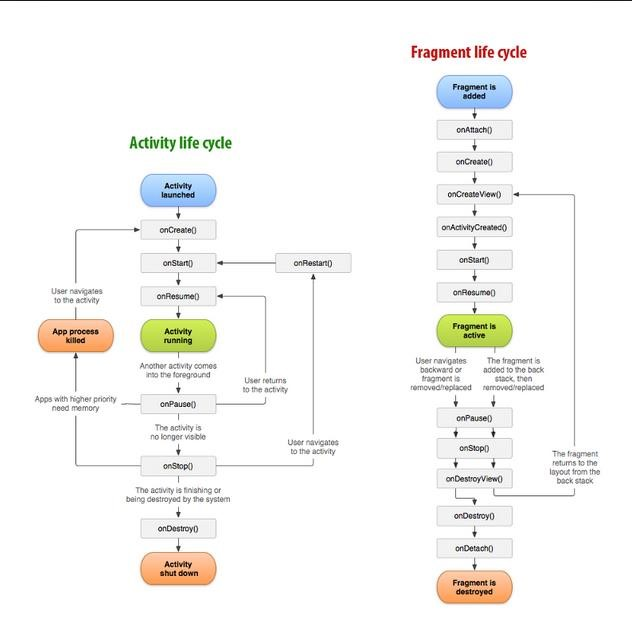
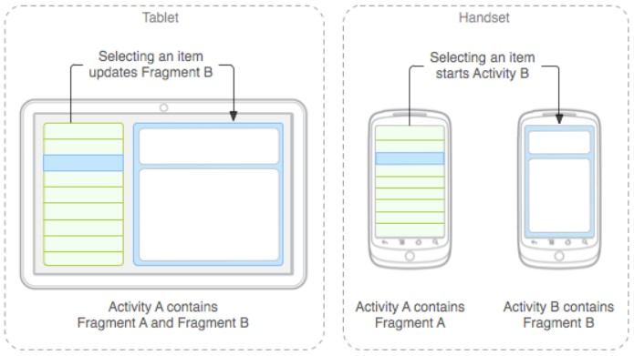
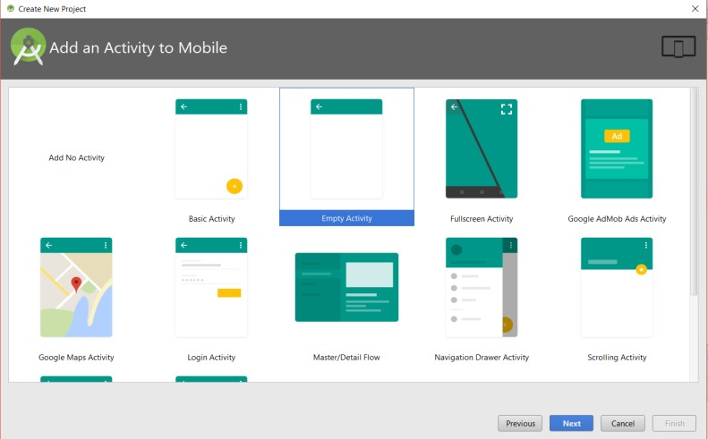
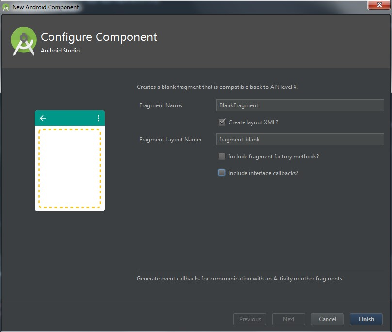
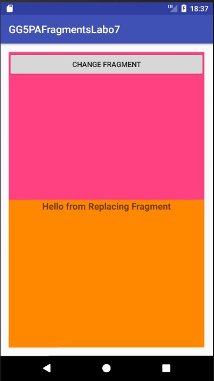
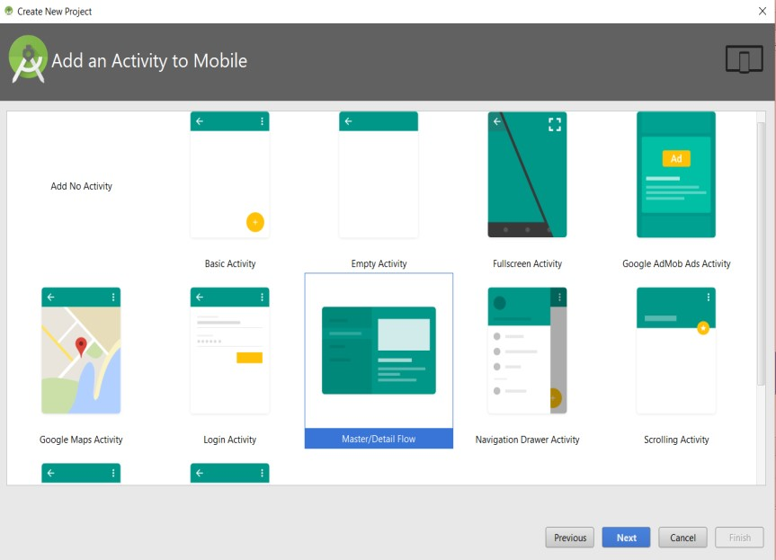

# Laboratoire 7: Les fragments

Laboratoire original par Ronald Jean-Julien.  
Corrigé et converti en Markdown par Corentin Brunel.  
Modifications apportées par Philippe Doyon et Antoine Brassard Lahey.

## Objectifs d’apprentissage

- Créer et utiliser les fragments 
- Comprendre les fragments statiques 
- Comprendre les fragments dynamiques 
- Comprendre le cycle de vie des fragments 
- Comprendre la communication inter-fragments 
- Cibler différents périphériques dans une même application 
([Réf.](https://developer.android.com/guide/components/fragments.html))  
 
Un fragment représente une portion d’interface que vous pouvez attacher à une activité, il a son propre cycle de vie, gère ses propres événements. Ils peuvent être ajoutés aux activités de façon statique ou de façon dynamique. Vous pouvez combiner plusieurs fragments dans une activité. Les fragments ont été introduits sur Android avec l’arrivée des tablettes sur le marché. Ils permettent de rendre les applications compatibles à la fois sur les smartphones et sur les tablettes. Ils ont permis de mieux exploiter la grande surface offerte par les tablettes. 
Un fragment peut être créé en dehors de toute activité mais lui est étroitement lié une fois qu’il y est attaché à cette activité. Son cycle de vie devient dépendant du cycle de vie de l’activité hôte. Le schéma ci-dessous définit le cycle de vie d’un fragment. 

Pour permettre à deux fragments de pouvoir communiquer entre eux, il est très important de passer par l’activité hôte. 

Pour créer un fragment, vous devez créer une classe héritant de la classe Fragment. La classe Fragment a un ensemble de méthodes de callbacks similaires à la classe Activity. Généralement, vous n’aurez qu’à redéfinir les méthodes `onCreate()`, `onCreateView()`, `onPause()`, `onStop()`. 

## Fragment statique

Dans ce premier exemple que vous allez mettre en place, vous allez utiliser les fragments de façon statique. Vous allez en ajouter 2 à votre activité. 
Créer un projet dans Android en choisissant l’option "Empty Activity". 

Créez 2 fragments (`ColoringFragment` et `ColoredFragment`) que vous allez ajouter à votre activité de façon statique. Cliquez sur File -> New  -> Fragment(Blank). Décochez les options "Include fragment factory methods?" et "Include interface callbacks?". 

Modifiez le fichier de layout de l’activité en lui ajoutant 2 fragments. Le premier occupant la première partie de l'écran (haut) et le deuxième occupant la deuxième partie (bas) dans le sens vertical. Donnez un **identifiant** à chacun de vos fragments. Vos fragments doivent remplir la largeur de l’écran. Votre fichier de `Layout` ressemblera au contenu ci-dessous. Donnez un id à chacun des fragments. Celui du haut doit être `coloringFragment` et celui du bas `coloredFragment`. 

~~~ xml
<?xml version="1.0" encoding="utf-8"?>
<android.support.constraint.ConstraintLayout 
    xmlns:android="http://schemas.android.com/apk/res/android"
    xmlns:app="http://schemas.android.com/apk/res-auto"
    xmlns:tools="http://schemas.android.com/tools"
    android:layout_width="match_parent"
    android:layout_height="match_parent" 
    tools:context="cgodin.qc.ca.gg5pafragmentslabo7.MainActivity"> 
 
    <fragment android:id="@+id/fragment" 
        android:name="cgodin.qc.ca.gg5pafragmentslabo7.ColoringFragment"
        android:layout_width="368dp"
        android:layout_height="244dp"
        android:layout_marginLeft="8dp"
        android:layout_marginStart="8dp"
        android:layout_marginTop="0dp"
        app:layout_constraintLeft_toLeftOf="parent"
        app:layout_constraintTop_toTopOf="parent"
        tools:layout="@layout/fragment_coloring"/> 
 
    <fragment android:id="@+id/fragment2"
        android:name="cgodin.qc.ca.gg5pafragmentslabo7.ColoredFragment"
        android:layout_width="368dp"
        android:layout_height="0dp"
        android:layout_marginBottom="0dp"
        android:layout_marginLeft="0dp"
        android:layout_marginTop="2dp" 
        app:layout_constraintBottom_toBottomOf="parent"
        app:layout_constraintLeft_toLeftOf="parent"
        app:layout_constraintTop_toBottomOf="@+id/fragment"
        app:layout_constraintVertical_bias="0.504"
        android:layout_marginStart="8dp"
        tools:layout="@layout/fragment_colored"/> 

</android.support.constraint.ConstraintLayout> 
~~~

## Communication entre les fragments

Vous allez dans cette partie modifier le fragment du haut (`coloringFragment`) pour envoyer un message au fragment du bas (`coloredFragment`).

Le fragment du haut est appelé fragment colorant et celui du bas fragment coloré. Quand l’utilisateur va cliquer sur le fragment colorant, vous allez envoyer un message au fragment coloré pour lui appliquer une couleur aléatoire provenant du fragment colorant.  Pour appliquer le principe du couplage faible, vous allez passer par l’activité hôte pour envoyer un message du fragment colorant au fragment coloré. En vertu de ce principe, vous ne devez pas créer un objet du type fragment coloré à l’intérieur du fragment colorant pour lui envoyer un message.

Pour ce faire, créez une interface dans le fragment comme suit (dans le `coloringFragment`) : 

~~~ java
public interface OnColoringFragmentInteractionListener { 
    // TODO: Update argument type and name
    void onSendColorFragmentInteraction(int color);
} 
~~~

Cette interface doit être implémentée par l’activité hôte. Pour obliger l’activité hôte à implémenter cette interface, redéfinissez la méthode de Callback onAttach comme suit dans le fragment colorant. Le casting impose sa volonté d’implémentation de l’interface à l’activité.

**Pourquoi?

Pour que notre fragment puisse être utilisé avec n'importe quelle Activity! L'interface contient toutes les façons que le fragment peut intéragir avec l'activité hôte. Ainsi, pour qu'une activité soit compatible avec notre fragment, il faut qu'il soit prêt à gérer les actions du fragment, qu'il implémente son interface.

~~~ java
@Override 
public void onAttach(Context context) {
    super.onAttach(context); 

    if (context instanceof OnColoringFragmentInteractionListener) {
        mListener = (OnColoringFragmentInteractionListener) context; 
    } else { 
        throw new RuntimeException(context.toString() 
                + " must implement OnColoringFragmentInteractionListener"); 
    } 
} 
~~~

Créez le champ `mListener` dans la classe `coloringFragment` :

~~~ java
private OnColoringFragmentInteractionListener mListener; 
~~~

Ajoutez un listener sur le layout du fragment colorant pour envoyer un message au fragment coloré quand l’utilisateur va cliquer sur le fragment colorant. 

~~~ java
coloringFragmentLayout.setOnClickListener(new View.OnClickListener() { 
    @Override 
    public void onClick(View view) { 
        mListener.onSendColorFragmentInteraction(new Random().nextInt()); 
    } 
}); 
~~~

`coloringFragmentLayout` doit être initialisé dans la méthode `onCreateView`.
Indice: cette variable est un objet `View`.  

Dans la classe `MainActivity` représentant l’activité hôte dans ce cas précis, créez un champ `coloredFragment` de type `ColoredFragment`.
 
La classe `MainActivity` doit implémenter	l’interface 
`OnColoringFragmentInteractionListener` comme suit :

~~~ java
public class MainActivity
    extends AppCompatActivity
    implements ColoringFragment.OnColoringFragmentInteractionListener { 
    }
~~~

Dans `MainActivity`, Implémentez la méthode `onSendColorFragmentInteraction` comme suit : 

~~~ java
@Override 
public void onSendColorFragmentInteraction(int color) {
    coloredFragment.setLayoutBackgroundColor(color);
} 
~~~

Créer un champ du type `coloredFragment` (fragment coloré) dans `MainActivity` 

~~~ java
ColoredFragment coloredFragment;
~~~

Et initialisez l’objet comme suit dans la méthode `onCreate`

~~~ java
coloredFragment = (ColoredFragment) getFragmentManager().findFragmentById(R.id.coloredFragment);
~~~

Conseil: `FragmentManager` est devenu obsolète à partir de l'API 28. Vous pouvez utiliser `SupportFragmentManager`.  

Dans le fragment coloré (`ColoredFragment`), implémentez la méthode `setLayoutBackgroundColor` comme suit :

~~~ java
public void setLayoutBackgroundColor(int color) 
{ 
   coloredFragmentLayout.setBackgroundColor(color); 
} 
~~~

Dans la classe `ColoredFragment`, créez le champ `coloredFragmentLayout` et initialisez-le dans la méthode `onCreateView` comme dans le cas du fragment colorant.  
 
Ajoutez des Logs dans les méthodes de callback indiquées sur le graphique du cycle de vie pour afficher les noms des méthodes appelées avec les noms de classes correspondantes. 

Faites la même chose dans l’activité hôte. 

Lancez l'application et observez les appels aux méthodes de callback.  

Inspirez-vous de cette approche de communication entre les fragments pour envoyer un message (dans le sens inverse) du fragment coloré au fragment colorant affichant dans ce dernier un message "Merci de m’avoir coloré". Placez un bouton "Remerciements" dans le fragment coloré pour envoyer un message au fragment colorant. Modifier le programme pour que ce bouton soit actif dans le fragment coloré après avoir été effectivement coloré par le fragment colorant. 
 
Ajoutez une liste (`ListView`) avec des couleurs au fragment de haut. Modifiez le programme pour que quand l'utilisateur sélectionne une couleur que le fragment de bas prenne cette couleur. 

## II. Fragment dynamique

Ajoutez une autre activité (Option `Empty Activity`), nommée DynamicColoredFragmentHostActivity, au projet. 

**Comment y naviguer? Aucune idée**

Dans le layout de l’activité, ajoutez deux layout linéaires partageant l’écran en deux parties égales de haut en bas en mode portrait (et de la droite vers la gauche en mode paysage), chacun ayant une couleur de fonds différente l’une de l’autre.

~~~ xml
<?xml version="1.0" encoding="utf-8"?> 
<LinearLayout
    xmlns:android="http://schemas.android.com/apk/res/android"
    xmlns:tools="http://schemas.android.com/tools"
    android:layout_width="match_parent"
    android:layout_height="match_parent"
    android:orientation="vertical" 
    android:paddingBottom="@dimen/activity_vertical_margin"
    android:paddingLeft="@dimen/activity_horizontal_margin"
    android:paddingRight="@dimen/activity_horizontal_margin"
    android:paddingTop="@dimen/activity_vertical_margin"
    tools:context=".DynamicColoredFragmentHostActivity"> 
 
    <LinearLayout 
        android:orientation="vertical"
        android:layout_width="match_parent"
        android:layout_height="0dp"
        android:layout_weight="1"
        android:id="@+id/topLinearLayout"
        android:background="@color/colorAccent" 
        android:layout_gravity="center_horizontal">
    </LinearLayout> 
 
    <LinearLayout 
        android:orientation="vertical"
        android:layout_width="match_parent"
        android:layout_height="0dp"
        android:layout_weight="1"
        android:id="@+id/bottomLinearLayout" 
        android:background="@android:color/holo_orange_dark"
        android:layout_gravity="center_horizontal">
    </LinearLayout>

</LinearLayout> 
~~~

~~Ajoutez 2 classes (`ColoringFragment` et `ColoredFragment`) de fragments à votre projet.~~ Ajoutez ensuite 2 objets fragments à votre activité. N'oubliez pas de faire en sorte que DynamicColoredFragmentHostActivity implémente les interfaces que ColoringFragment et ColoredFragment utilisent.

~~~ java
ColoredFragment dynamicColoredFragment; 
ColoringFragment dynamicColoringFragment;
~~~

Placez les fragments dans les layout définis précédemment comme suit dans la méthode `onCreate`: 

~~~ java
dynamicColoredFragment = new ColoredFragment();
dynamicColoringFragment = new ColoringFragment();
 
FragmentManager fragmentManager = getFragmentManager(); 
FragmentTransaction fragmentTransaction = fragmentManager.beginTransaction(); 

fragmentTransaction.add(R.id.topLinearLayout, dynamicColoringFragment);
fragmentTransaction.add(R.id.bottomLinearLayout, dynamicColoredFragment); 

fragmentTransaction.commit();
~~~

Lancez le programme. Les deux fragments doivent s’afficher correctement. 
 
Ajoutez un 3ème fragment (classe `ReplacingFragment`) au programme qui va remplacer le fragment du bas.  

Remplacer la méthode onAttach avec ce qui suit.

~~~ java
@Override
void onAttach(Context context) {
    super.onAttach(context)
    listener = context
}
~~~

*Ceci est possible car ReplacingFragment n'intéragit avec son activité parent. Cette dernière n'a donc pas besoin d'implémenter d'interface pour être compatible avec le fragment.*

Ajoutez dans le fragment de haut un autre bouton par la programmation vous permettant de remplacer le fragment du bas par le `ReplacingFragment`. 

Créer un bouton dans le fragment de haut vous permettant de remplacer le fragment du bas. Le code de remplacement du fragment ressemble à ceci : 

~~~ java
ReplacingFragment replacingFragment = new ReplacingFragment(); 
btnChangeFragment.setOnClickListener(new View.OnClickListener() { 
    @Override 
    public void onClick(View view) { 
        FragmentTransaction ft = getFragmentManager().beginTransaction(); 

        ft.replace(R.id.bottomLinearLayout, replacingFragment); 
        ft.addToBackStack(null); 

        ft.commit(); 
    }
});
~~~

Vérifiez que le fragment `replacingFragment` remplace effectivement le fragment existant (`dynamicColoredFragment`). 

La ligne addToBackStack vous permet d’ajouter la transaction à la pile de transaction.  
Cliquez sur le bouton "Change Fragment" du fragment du haut pour remplacer le fragment du bas (`DynamicColoredFragment`) par le fragment remplaçant.  
Cliquez encore 3 fois sur ce même bouton.  
Cliquez maintenant pour revenir en arrière avec la touche Retour Arrière du périphérique.  
Observez le comportement.  
Mettez en commentaire la ligne qui suit dans votre `DynamicFragment`.

~~~ java
ft.addToBackStack(null); 
~~~

Lancez à nouveau le programme.  
Cliquez pour revenir en arrière avec la touche Retour Arrière du périphérique et observez le comportement. 

## III. Fragment Master-Détail

Dans cette deuxième partie du labo, vous allez créer une application qui va vous permettre de faire la communication entre un `RecyclerView` et un fragment. Dans ce casci, vous allez utiliser un template master-detail. Les `RecyclerViews` sont une version un peu plus évoluée et plus performante des `ListView`.  
Créez un projet en choisissant l’option master-detail

Laissez les options par défaut et cliquez sur Finish pour créer l’application.  
Le programme, tel qu’il est créé au départ, vous permet de manipuler des objets bidons appelés `Item`. Exécutez le programme sur une tablette et cliquez sur les items à gauche et les informations s’afficheront dans la partie de droite. Exécutez l’application sur un téléphone et remarquez que vous aurez une nouvelle fenêtre pour afficher les mêmes détails qui étaient affichés à droite sur la tablette.  
Dans ce programme, vous avez trois classes avec pour activité hote `ItemListActivity`. Vous avez un fragment qui s’affiche soit dans la partie droite dans le cas d’une tablette et dans l’activité `ItemDetailActivity` dans le cas d’un smartphone.  
Les items qui sont manipulés sont placés dans le sous-package dummy. Une classe `DummyContent` et une classse interne `DummyItem`. Les informations de la classe `DummyItem` sont les suivantes : id, content, details.  
Créez un sous package encapsulant une classe Person vous permettant de manipuler des personnes à la place des `DummyItems`. Vous pouvez vous inspirer de l’approche de manipulation des `DummyItem`. Les champs de la classe Person sont les suivants : id, firstName, lastName, phoneNumber, email, address, city, country. Ajoutez les méthodes equals et toString dans la classe Person.  
Dans le fragment de gauche, affichez seulement les noms et prénoms des personnes.  Dans le fragment de détail, affichez toutes les informations sur la personne sélectionnée dans le fragment de gauche dans des `EditText`.  
Ajoutez des boutons Save, Delete et Update vous permettant de faire les opérations de CRUD sur les données.  
Vous pouvez alimenter la source de donnée au démarrage de l’application comme dans le cas des `DummyItem`.  
A la suppression d’une personne dans le fragment de droite, vous devez automatiquement mettre à jour le `RecyclerView` dans la partie gauche. Utilisez l’approche de communication des fragments pour envoyer un message au `RecyclerView` pour mettre à jour ses données.  

Bonus : A la place des `ArrayList` et `HashMap`, utilisez une base de données pour stocker les données. Vous pouvez vous inspirer du labo 6 pour sur la persistance des données avec `SQLite`.  

**Bon Travail!**
