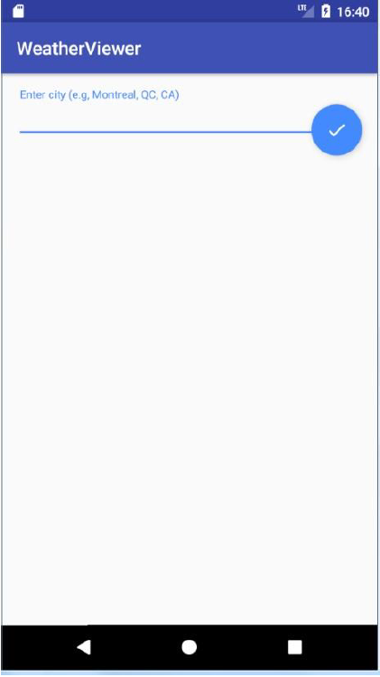

# Laboratoire 8
## Les tâches asynchrones et la manipulation des fichiers JSON

### Objectifs d’apprentissage

- Manipuler les fichiers JSON
- Comprendre les taches asynchrones (classe AsyncTask)
- Créer des tâches qui ne bloquent pas l'UI Thread

### Références
- [AsyncTask](https://developer.android.com/reference/android/os/AsyncTask)
* [JSON Parser](http://www.tutorialspoint.com/android/android_json_parser.htm)
- [JSON](http://json.org/)
 
## JSON

Prenez l'application JSON situé dans votre zip. Lancez-la et essayez de comprendre le
code. Cette application vous permet de décoder un fichier JSON et d'affcher les données
qui se trouvent dedans.

Vous allez décoder un autre fichier se trouvant dans le même répertoire assets pour
afficher les données dans un ListView ou un RecyclerView.

Vous devez utiliser en plus du JSONObject présent dans le code un JSONArray pour lire les
données du tableau se trouvant dans le fichier JSON. A rappeler que dans les fichiers JSON,
les accolades {} représentent des objets et les crochets [] représentent des tableaux. Et
vous avez des paires clé/valeur dans les fichiers JSON.

Dans un deuxième temps, vous allez chercher un fichier JSON à partir d'un service Web
sur Internet pour afficher les données.

Lors du passage d'une application au premier plan, l'exécution des différents traitements
et taches s'effectue dans l'UI Thread (User Interface Thread). Ce thread est le cœur de 
votre application et il s'occupe de toute la gestion des interfaces et des interactions
utilisateur avec l'application.

Tout le code présent dans une composante de votre application (activité, service,
fournisseur de contenu, etc.) sera exécuté par l'UI Thread. Il est donc très important pour
l'expérience utilisateur, ce thread ne comporte aucun traitement lourd et qu'il ne soit
jamais bloqué (ce qui bloquerait l'utilisateur dans son interaction avec son application).

### AsyncTasks

Les AsyncTasks vous permettent d'exécuter facilement un traitement en tache de fond et
de répercuter le résultat sur l'interface utilisateur sans bloquer l'UI Thread.

Pour utiliser les AsyncTasks, il faut créer une nouvelle classe qui étend la classe AysncTask
qui est une classe abstraite.

La classe AsyncTask est paramétrée par 3 types de données:

- Le type de donnée passé en argument à la classe et plus précisément à la méthode
doInBackground.
- Le type de donnée utilize pour publier l'avancement de la tache en cours
d'exécution. Il est utilize dans la méthode onProgressUpdate (dans une barre de
progression horizontale par exemple).
- Le type de donnée utilize pour publier le résultat sur l'interface, il sera transmis à
la méthode onPostExecute par la méthode doInBackground.

La classe AsyncTask vous permet de surcharger les méthodes suivantes:

- **onPreExecute**: vous permet de mettre à jour l'interface de votre application avant
le début de l'exécution de la tâche en arrière-plan. Cette méthode est exécutée
dans l'UI Thread.
- **doInBackground**: est exécutée dans un Thread séparé, ce qui vous permet
d'exécuter un traitement lourd en tâche de fond.
- **onProgressUpdate**: permet de mettre à jour la progression de la tâche en cour
d'exécution. Elle est appelée à l'aide de la function publishProgress.
- **onPostExecute**: permet de mettre à jour l'interface avec le résultat obtenu à la fin
du traitement exécuté dans la méthode doInBackground. 

## Volley

Volley est une librairie HTTP conçue pour Android qui gère, entre autres, le caching et les connexions concurrentielles.

Pour inclure Volley à votre projet, ajouter `implementation 'com.android.volley:volley:1.0.0'` dans la section `dependencies` de votre `build.gradle`

### Faire des requêtes (synchrone)

Trois objets permettent, ensemble, de faire des requêtes HTTP avec Volley. La méthode démontrée sert à faire des requêtes synchrones, utile dans notre cas puisque les AsyncTask se font déjà sur un autre thread.

Ces objets sont:

- **JsonObjectRequest**: Permet de bâtir des requêtes, puis de gérer les évènements de succès et d'erreur de façon asynchrone. Par contre, nous allons utiliser `RequestFuture` pour rendre le traitement synchrone.
- **RequestFuture\<T\>**: Sert de Listener pour le succès de requetes et les évènements d'erreur pour les gérer de façon synchrone.
- **RequestQueue**: S'occupe d'exécuter la requête et de gérer la concurrence. Dans notre cas nous l'utiliseront avec `Volley.newRequestQueue()`

### Un exemple

```Java
String url = "http://www.api.com/donnees";

RequestQueue requestQueue = Volley.newRequestQueue(context) //Créé un nouveau RequestQueue en y passant un context comme, par exemple, une Activité.
requestQueue.start();

RequestFuture<JSONObject> future = RequestFuture.newFuture();
JsonObjectRequest requete = new JsonObjectRequest(RequestMethod.GET, url, null, future, future) //Future gère le succès et l'échec de la requête.

requestQueue.add(requete); //Pour que le queue s'occupe d'exécuter notre requête

//Maintenant nous pouvons récupérer la réponse et gérer les erreurs s'il y a lieu.
try {
    JSONObject reponse = future.get(); //ceci bloque l'exécution en attendant la réponse du serveur.

    ... //Nous avons maintenant accès à la réponse JSON du serveur. Pour lire l'objet JSON, voir l'exemple de Roro
} catch (Exception e) {
    e.printStackTrace
}

requestQueue.stop();
```

## Application

Créez un nouveau projet avec Android Studio. Cette application va vous permettre de
simuler l'exécution d'une tâche asynchrone en arrière-plan en animant une barre de
progression horizontale au fur et à mesure de l'exécution de la tâche en arrière-plan. Par
la suite vous allez créer une autre application vous permettant de télécharger un fichier
JSON à partir d'un service Web pour afficher des données.

Ajoutez un bouton (launch_async) et une barre de progression à votre interface.

Une barre de progression horizontale doit être cachée par défaut en lancant votre activité
(visibility=gone).

Créez une classe interne dans MainActivity qui s'appelle `GGDownloadTask` héritant de la classe AsyncTask<String, Integer,
String>.

Implémentez la méthode onPreExecute afin de cacher le bouton et d'afficher la barre de
progression.

```Java
@Override
protected void onPreExecute() {
    super.onPreExecute();
    launchAsync.setVisibility(View.GONE);
    progress.setVisibility(View.VISIBLE);
}
```

Implémentez la méthode doInBackground comme suit:

```Java
//Cette méthode prend en argument un tableau illimité de chaines de caractères
@Override
protected void doInBackground(String... params) {
    String uri = params[0];

    String result = "";

    for (int i = 1; i <= 10; i++) {
        try {
            Thread.sleep(1000L);
        } catch (InterruptedException e) {
            e.printStackTrace();
        }

        publishProgress(i * 10);
        result += i;
    }

    return result;
}
```

Créez un un listener sur votre bouton vous permettant de lancer votre AsyncTask comme
suit:

```Java
launchAsync.setOnClickListener(new OnClickListener(){
    @Override
    public void onClick(View view) {
        new GGDownloadTask().execute("test");
    }
});
```

Vous devez animez la progression au fur et à mesure en utilisant la méthode onProgress
comme suit:

```Java
@Override
protected void onProgressUpdate(Integer... progress) {
    super.onProgressUpdate(progress);
    MainActivity.this.progress.setProgress(progress[0]);
}
```

Ajoutez une méthode onPostExecute vous permettant d'envoyer un message après
l'exécution de votre tâche de fond.

```Java
@Override
protected void onPostExecute(String s) {
    super.onPostExecute(s);
    Toast.makeText(MainActivity.this, "Fin de l'exécution du traitement en arrière-plan", Toast.LENGTH_SHORT).show();
    launchAsync.setVisibility(View.VISIBLE);
    progress.setVisibility(View.GONE);
}
```

## ~~Application 3~~

## Application 2

Créez un nouveau projet avec Android Studio avec l'option BlankActivity.

Ce projet doit vous permettre d'aller chercher un fichier JSON à partir du site
openWeatherMap.org et les afficher dans un ListView ou un RecyclerView. Vous devez
vous enregistrer en créant une clé d'API (API key) pour pouvoir utiliser l'API du site. Vous
allez trouver les informations d'utilisation de l'API sur le site ci-après qui dispose encore
d'autres services Web que vous pouvez explorer.
http://api.openweathermap.org/data/2.5/forecast/daily?q=

Vous devez aller chercher des informations concernant la température d'une ville donnée
dans le monde.

Sur votre interface, vous devez avoir un EditText
permettant à l'utilisateur de saisir la ville, l'état ou la
province, et le nom du pays comme c'est expliqué dans la documentation de l'API. Vous 
allez recevoir le flux JSON correspondant. Vous devez utiliser aussi le
bouton FloatingActionButton créé à coté de votre EditText
permettant d'aller chercher les données JSON quand on
clique dessus. Ce bouton est créé par défaut avec votre
application. Remplacez l'icône du bouton par l'icône Done
disponible dans Vector Assets dont l'approche a déjà
utilisée dans l'un des labs précédents.

Aux données JSON récupérées, il y a une icône correspondante que vous devez aussi
récupérer du même site à l'adresse suivante. Cette icone correspond à la météo du jour.
Vous devez affichez cette icone comme c'est indiqué ci-dessous dans une ImageView à
gauche.
```Java
"http://openweathermap.org/img/w/" + iconName + ".png" 
```

`iconName` représente le nom de l'icône provenant du fichier JSON. 




A remettre dans un fichier zippé au plus tard le lundi 15 octobre à 17h.

**Bon travail !**
